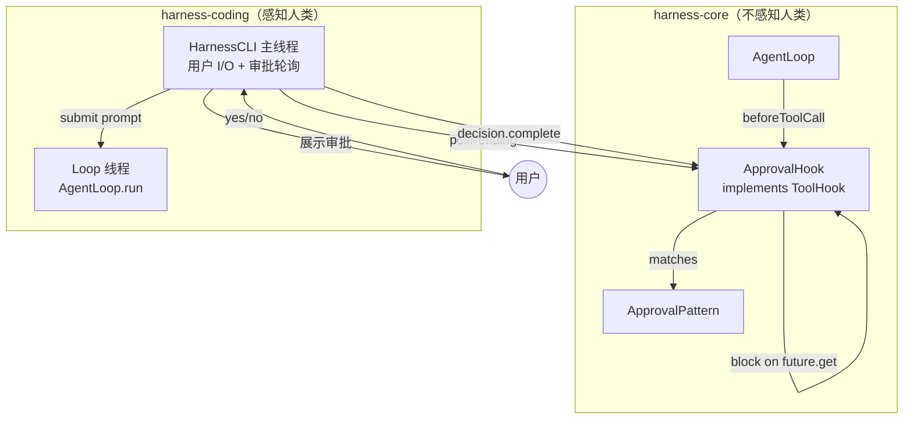
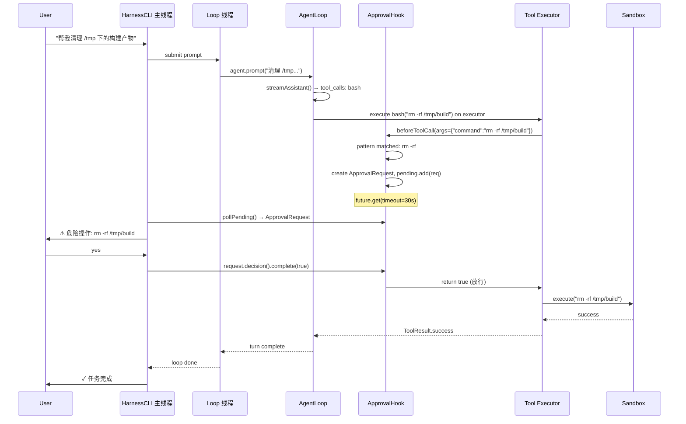

# Human-in-the-Loop 审批系统设计规格

> 工具执行前暂停，征得人类同意——不侵入 AgentLoop，纯 Hook 层实现

**日期：** 2026-06-15  
**状态：** 设计已审查，待实现  
**依赖：** `harness-core` ToolHook 接口（已存在），`harness-coding` HarnessCLI（需改造线程模型）

---

## 一、动机

当前框架已具备 HITL 的骨架但缺少闭环：

| 已有 | 缺失 |
|------|------|
| `ToolHook.beforeToolCall()` 可返回 false 阻止执行 | 阻止之后没有"等人回复 → 继续"的通道 |
| `.harness/config.yaml` 有 `requireApprovalFor` 配置项 | 没有任何代码读取和执行这个配置 |
| `Agent` 状态机有 RUNNING/STOPPED | 没有 WAITING_FOR_APPROVAL 这样的暂停态 |

本次设计补全闭环：**工具执行 → 模式匹配命中 → 阻塞等人决策 → 放行/拒绝。**

---

## 二、架构原则

> **AgentLoop 是纯执行引擎，不感知"人类"的存在。**

```
harness-core（框架层，不知道人类）
  ├── AgentLoop          ← 零改动
  ├── ToolHook           ← 零改动，接口已完美
  ├── ApprovalHook       ← 新：检测危险命令，阻塞等决策
  └── ApprovalPattern    ← 新：配置驱动的危险模式

harness-coding（产品层，知道人类）
  └── HarnessCLI         ← 改：主线程处理用户 I/O + 审批交互
                            loop 移到独立线程
```



---

## 三、组件设计

### 3.1 ApprovalPattern

```java
package io.github.frank.harness.core.approval;

import java.util.regex.Pattern;

/**
 * A single dangerous-command pattern loaded from config.
 *
 * Each pattern has a type (for UI categorization) and a regex.
 * The regex is pre-compiled at construction time.
 */
public record ApprovalPattern(
    String type,          // "file_destruction" | "privilege_escalation" | ... | custom
    String regex,         // compiled to java.util.regex.Pattern
    String description    // 人类可读的说明，如 "删除文件/目录"
) {
    public boolean matches(String command) {
        return Pattern.compile(regex).matcher(command).find();
    }
}
```

### 3.2 ApprovalRequest

```java
package io.github.frank.harness.core.approval;

import java.util.concurrent.CompletableFuture;

/**
 * A pending approval request.
 *
 * Created by ApprovalHook when a dangerous command is detected.
 * The CompletableFuture is blocked on by the tool execution thread.
 * The UI thread (HarnessCLI) presents it to the user, then completes it.
 */
public record ApprovalRequest(
    String id,                             // UUID, for tracking
    String toolName,                       // "bash"
    String command,                        // 原始命令（已脱敏："rm -rf /tmp/**"）
    String riskType,                       // 来自 ApprovalPattern.type()
    String matchedPattern,                 // 命中的正则（人类可读版）
    CompletableFuture<Boolean> decision    // true=放行, false=拒绝
) {}
```

### 3.3 ApprovalHook

```java
package io.github.frank.harness.core.approval;

import com.fasterxml.jackson.databind.JsonNode;
import io.github.frank.harness.ai.protocol.Content.ToolCallContent;
import io.github.frank.harness.ai.protocol.ToolResult;
import io.github.frank.harness.core.hook.ToolHook;

import java.time.Duration;
import java.util.List;
import java.util.UUID;
import java.util.concurrent.*;

/**
 * ToolHook that blocks dangerous commands until human approves.
 *
 * Injected into Agent via Agent.Builder.hooks(approvalHook).
 * AgentLoop calls beforeToolCall() in the tool executor thread.
 * If a pattern matches → ApprovalRequest created, thread blocks on future.get().
 * HarnessCLI polls pollPending() in its main thread, presents to user,
 * then completes the future → unblocks the tool thread.
 *
 * Timeout: if user doesn't respond within approvalTimeout, auto-reject.
 *
 * Thread safety: ConcurrentLinkedQueue is lock-free. CompletableFuture
 * get()/complete() are thread-safe by design.
 */
public class ApprovalHook implements ToolHook {
    private final List<ApprovalPattern> patterns;
    private final ConcurrentLinkedQueue<ApprovalRequest> pending;
    private final Duration approvalTimeout;

    public ApprovalHook(List<ApprovalPattern> patterns, Duration approvalTimeout) {
        this.patterns = List.copyOf(patterns);
        this.pending = new ConcurrentLinkedQueue<>();
        this.approvalTimeout = approvalTimeout;
    }

    // ── ToolHook implementation ───────────────────────────

    @Override
    public boolean beforeToolCall(ToolCallContent call, JsonNode args) {
        String command = extractCommand(call, args);
        if (command == null || command.isBlank()) return true;

        for (var p : patterns) {
            if (p.matches(command)) {
                var req = new ApprovalRequest(
                    UUID.randomUUID().toString(),
                    call.name(),
                    sanitize(command),
                    p.type(),
                    p.description(),
                    new CompletableFuture<>()
                );
                pending.add(req);

                try {
                    return req.decision().get(
                        approvalTimeout.toMillis(), TimeUnit.MILLISECONDS);
                } catch (TimeoutException e) {
                    return false; // 超时自动拒绝
                } catch (InterruptedException e) {
                    Thread.currentThread().interrupt();
                    return false;
                } catch (ExecutionException e) {
                    return false; // future 异常完成 → 拒绝
                }
            }
        }
        return true; // 无匹配 → 放行
    }

    @Override
    public ToolResult afterToolCall(ToolCallContent call, ToolResult result) {
        return result; // 审批不关心后置钩子，透传
    }

    // ── HarnessCLI 轮询 API ───────────────────────────────

    /** Non-blocking poll. Returns null if no pending requests. */
    public ApprovalRequest pollPending() {
        return pending.poll();
    }

    /** True if there are pending requests the user hasn't answered yet. */
    public boolean hasPending() {
        return !pending.isEmpty();
    }

    // ── Private helpers ────────────────────────────────────

    /** Extract the command string from tool arguments. */
    private String extractCommand(ToolCallContent call, JsonNode args) {
        return args.has("command") ? args.get("command").asText() : null;
    }

    /** Remove sensitive tokens from commands shown to user. */
    private String sanitize(String command) {
        return command.replaceAll("(?:--api-key|--token|--password)\\s+\\S+",
            "$1 ***");
    }
}
```

### 3.4 审批流程序列图



---

## 四、HarnessCLI 线程模型改造

### 当前模型（单线程）

```java
while (true) {
    String input = scanner.nextLine();
    session.prompt(input, event -> print(event));
    // ← 阻塞直到 loop 结束，用户在此期间无法交互
}
```

### 改造后（双线程）

```java
var approvalHook = new ApprovalHook(loadPatterns(), Duration.ofSeconds(30));
var agent = Agent.builder()
    .tools(tools)
    .hooks(List.of(approvalHook))
    .build();

var loopExecutor = Executors.newSingleThreadExecutor();
Future<?> currentLoop = null;

while (true) {
    String input = scanner.nextLine().trim();
    if ("/exit".equals(input)) break;

    // 提交 loop 到独立线程
    currentLoop = loopExecutor.submit(() -> {
        session.prompt(input, event -> {
            // 事件处理移到 loop 线程中，System.out 线程安全
            switch (event) {
                case TextDelta td -> System.out.print(td.text());
                // ...
            }
        });
    });

    // 主线程：轮询审批 + 等待 loop 结束
    while (!currentLoop.isDone()) {
        var approval = approvalHook.pollPending();
        if (approval != null) {
            handleApproval(approval, scanner);  // 阻塞等用户回复
        }
        Thread.sleep(200);  // 避免忙等
    }
}
```

### handleApproval 交互示例

```
⚠️ 危险操作 [bash] — 需要审批
   命令: rm -rf /tmp/build
   风险: 文件删除 (匹配模式: rm -rf)
   允许执行? (yes / no / reason): yes
```

用户输入 `no` → `decision.complete(false)` → 工具阻塞在 `beforeToolCall` 收到 false → 返回 `ToolResult.blocked`。

---

## 五、配置文件

```yaml
# .harness/config.yaml 新增 approval 段
approval:
  enabled: true
  timeout: 30s
  patterns:
    - type: file_destruction
      pattern: "rm\\s+(-rf|--no-preserve-root)"
      description: "删除文件/目录"

    - type: privilege_escalation
      pattern: "sudo\\s+|chmod\\s+777|chown\\s+root"
      description: "提权操作"

    - type: data_exfiltration
      pattern: "curl.*\\|.*(ba)?sh|wget.*\\|.*sh"
      description: "下载并执行脚本"

    - type: git_force
      pattern: "git\\s+push\\s+.*--force"
      description: "强制推送"

    - type: file_mass_operation
      pattern: "find\\s+.*-delete|xargs\\s+rm"
      description: "批量文件操作"
```

---

## 六、边界情况处理

| 场景 | 行为 |
|------|------|
| **超时** | `future.get(30s)` 超时 → 自动拒绝，返回 `ToolResult.error("Approval timed out")` |
| **用户中途退出** | `/exit` → `currentLoop.cancel(true)` → 工具线程被中断 → `future.get()` 抛 InterruptedException → 返回 false |
| **同一批次多个危险命令** | 每个工具独立 executor 线程，各自调用 `beforeToolCall`，各自阻塞等审批。用户依次审批。 |
| **审批已启用但无危险命令** | `beforeToolCall` 快速检查所有 pattern → 无匹配 → 立即返回 true，零开销 |
| **审批配置为空** | 直接返回 true，零开销 |
| **future 异常完成** | `ExecutionException` 捕获 → 返回 false |
| **命令中包含敏感信息** | `sanitize()` 替换 `--api-key`/`--token`/`--password` 参数值 |
| **loop 线程 panic** | `loopFuture.get()` → ExecutionException → CLI 展示错误，不崩溃 |

---

## 七、测试策略

```java
// TestApprovalHook.java — harness-core 单元测试，不涉及线程

@Test void noPatternMatch_returnsTrue()           // 安全命令直接放行
@Test void patternMatch_blocks()                   // 危险命令创建 ApprovalRequest
@Test void userApproves_returnsTrue()             // decision.complete(true) → true
@Test void userRejects_returnsFalse()             // decision.complete(false) → false
@Test void timeout_returnsFalse()                  // future timeout → false
@Test void emptyPatterns_returnsTrue()            // 空配置全放行
@Test void commandExtraction_nullArgs()           // args 无 command 字段 → true
@Test void sanitize_hidesApiKey()                  // 脱敏验证

// TestApprovalCLI.java — harness-coding 集成测试
// TODO: 需要 mock stdin/scanner，暂用 manual test
```

---

## 八、新增文件清单

```
harness-core/src/main/java/io/github/frank/harness/core/
├── approval/
│   ├── ApprovalPattern.java       # record(type, regex, description)
│   ├── ApprovalRequest.java       # record(id, toolName, command, risk, future)
│   └── ApprovalHook.java         # implements ToolHook
│
harness-core/src/test/java/io/github/frank/harness/core/
├── approval/
│   └── TestApprovalHook.java

harness-coding/src/main/java/io/github/frank/harness/coding/cli/
└── HarnessCLI.java                # 改：双线程模型
```

**零新 Maven 依赖。** java.util.concurrent 标准库全覆盖。

---

## 九、与 Sandbox 的关系

**正交。** Sandbox 回答"在哪执行"，ApprovalHook 回答"能不能执行"。

```
AgentLoop
  ├── HookChain.beforeToolCall()
  │   └── ApprovalHook: 模式匹配 → 阻塞等人 → 放行/拒绝
  └── tool.execute()
      └── Sandbox.execute(): LocalSandbox 或 DockerSandbox
```

两者独立配置，独立演进，互不依赖。

---

## 十、生产演进预留

| TODO | 触发条件 |
|------|---------|
| 审批白名单（信任的命令/路径自动放行） | 用户反馈审批太频繁 |
| 审批历史记录（已批准的同类命令会话内不再问） | 同上 |
| 审批日志持久化（JSONL 记录所有审批决策） | 安全审计需求 |
| 审批 hook 链（多个审批规则，任一拒绝即拒绝） | 复杂安全策略 |
| 在 harness-core 的 approval 包里直接支持 | - |

---

*设计日期：2026-06-15 | 架构原则：AgentLoop 不感知人类*
