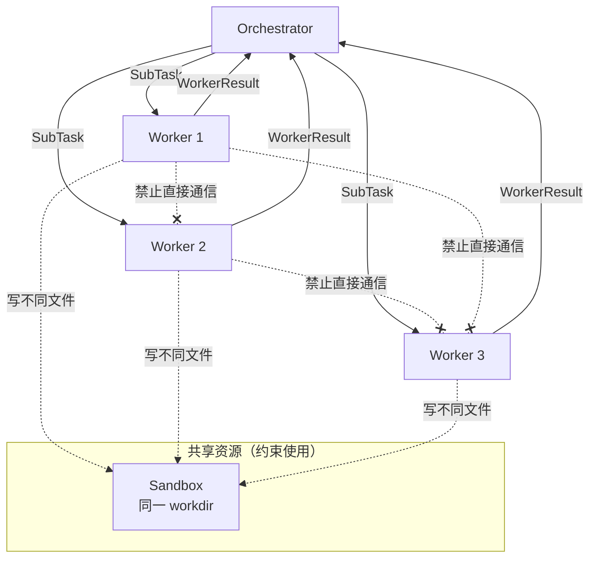
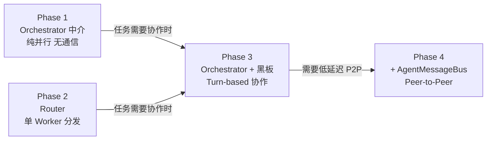

# Multi-Agent 通信模式设计

> 为什么 Phase 1 选 Orchestrator 中介而非黑板或 P2P，以及何时切换

**日期：** 2026-06-15  
**关联：** `docs/specs/2026-06-15-multi-agent-orchestrator-design.md`

---

## 一、三种通信模式

```
模式 A: Orchestrator 中介（当前选择）
  Worker1 ──→ Orchestrator ──→ Worker2
  ✓ 中心可控、易调试、故障隔离
  ✗ Orchestrator 单点

模式 B: 共享黑板（Blackboard）
  Worker1 ──→ [Shared Context] ←── Worker2
  ✓ 去中心化、适合探索型任务
  ✗ 状态一致性难保证、竞态问题

模式 C: 直接消息（Peer-to-Peer）
  Worker1 ←──→ Worker2
  ✓ 低延迟、适合紧密协作
  ✗ 耦合强、Worker 需感知对方存在
```

---

## 二、Phase 1 为什么选 A

### 2.1 Phase 1 的任务特征

```
用户目标: "为项目添加单元测试"

子任务1: 测 UserService    → 操作 UserServiceTest.java
子任务2: 测 OrderService    → 操作 OrderServiceTest.java  
子任务3: 测 PaymentService  → 操作 PaymentServiceTest.java
```

**三个子任务互相独立——不需要通信。** 在不需要通信的场景下强上 B 或 C 只有成本没有收益：

| 如果强上模式 B（黑板） | 如果强上模式 C（P2P） |
|------------------------|----------------------|
| Worker 写结果到黑板 → 序列化开销 | Worker 需知道其他 Worker 存在 |
| Orchestrator 读黑板 → 反序列化开销 | Worker 内嵌消息路由逻辑 |
| 黑板需版本控制防竞态 | Worker 崩溃 → 其他 Worker 死等 |
| 对独立任务收益 = 0 | 对独立任务收益 = 0 |

### 2.2 当前通信边界（硬规则）



**三条规则：**

1. **Worker 间不直接通信** — 消息必须经 Orchestrator 中转。
2. **Worker 不读取其他 Worker 的输出** — 每个 Worker 只知道自己的 SubTask goal，不知道其他 Worker 在做什么。
3. **Sandbox 共享但不冲突** — 共享 workdir 但 Prompt 约束文件不重叠。冲突是分解策略的 bug，不是通信模式的问题。

**为什么连读结果都不允许？** Worker1 读了 Worker2 的输出 → Worker1 的行为依赖 Worker2 的执行顺序 → 破坏并行性。Phase 1 的子任务只能是**纯并行、无交换**的。

---

## 三、各通信模式的形式化定义

### 3.1 Orchestrator 中介

```java
// Phase 1 现状
public interface CommunicationModel {
    // Worker → Orchestrator: 单向结果上报
    WorkerResult report(String subtaskId, WorkerResult result);

    // Orchestrator → Worker: 单向任务派发
    SubTask dispatch(String workerId);
}

// 无 Worker → Worker 通道
```

### 3.2 共享黑板（Phase 3 预留）

```java
// Phase 3 设计
public interface Blackboard {
    /** 写入一个键值对，附带 Agent 身份和版本号 */
    void write(String agentId, String key, Object value);

    /** 读取最新值 */
    Optional<BlackboardEntry> read(String key);

    /** 增量读取：返回自 timestamp 以来的所有更新 */
    List<BlackboardEntry> since(long timestamp);

    /** 订阅某个 key 的变更通知 */
    Subscription subscribe(String keyPattern, Consumer<BlackboardEntry> handler);
}

public record BlackboardEntry(
    String agentId,
    String key,
    Object value,
    long version,         // 单调递增
    long timestamp
) {}
```

**为什么 Phase 3 需要黑板？** 场景变了：

```
用户: "设计一个 API 并审查它"

Coder Agent    → blackboard.write("api-design-v1", code)
Reviewer Agent → blackboard.read("api-design-v1") → 发现问题
Reviewer Agent → blackboard.write("api-design-v1-review", findings)
Coder Agent    → blackboard.since(lastRead) → 看到审查意见 → 修改
Coder Agent    → blackboard.write("api-design-v2", fixedCode)
Reviewer Agent → blackboard.read("api-design-v2") → 通过
```

这里 Agent 之间有多轮对话，Orchestrator 单纯收结果已经不够——需要一个共享的、可增量读取的状态空间。

### 3.3 直接消息（远期预留）

```java
// 远期设计
public interface AgentMessageBus {
    /** A 发给 B */
    void send(String fromAgentId, String toAgentId, Message msg);

    /** 订阅发给自己的消息 */
    Subscription onMessage(String agentId, Consumer<Message> handler);
}
```

适用场景：两个 Agent 需要紧密的、低延迟的协作（如同步修改同一个文件）。当前项目暂不需要。

---

## 四、Phase 切换时的通信模式演进

### 4.1 今天（Phase 1）：纯并行

```java
// Orchestrator.execute()
var tasks = decomposer.decompose(goal);
// tasks 之间无依赖、无通信
var results = dispatchInParallel(tasks);  // ThreadPool
return synthesizer.synthesize(goal, results);
```

### 4.2 Phase 2（Router）：仍然是 A

```java
// Router.route()
var intent = classifier.classify(userMessage);
var agent = switch (intent) {
    case CODING    -> codingAgent;
    case REVIEW    -> reviewAgent;
    case RESEARCH  -> researchAgent;
};
return agent.run(userMessage);  // 单 Worker，无通信需求
```

### 4.3 Phase 3（Collaborative）：引入黑板

```java
// Orchestrator.execute() 扩展
var tasks = decomposer.decompose(goal);
var plan = decomposer.collaborationPlan();  // 新增

if (plan.hasCollaboration()) {
    // Turn-based 模式：黑板 + 轮次协调
    var blackboard = new InMemoryBlackboard();
    var coordinator = new TurnCoordinator(plan, blackboard, tasks);
    return coordinator.run();
} else {
    // Phase 1 路径：纯并行
    return dispatchInParallel(tasks);
}
```

### 4.4 演进总结



---

## 五、设计原则

1. **通信复杂度不超前于任务需求。** 不需要通信时，不引入通信机制。
2. **Worker 之间默认隔离。** 打破隔离需要显式声明协作关系（`CollaborationGraph`）。
3. **Orchestrator 始终是入口。** 即使 Phase 3 有黑板，Worker 不直接知道彼此——通过黑板间接交换，Orchestrator 仍然控制生命周期。
4. **通信模式可组合。** 同一个 Orchestrator 下可以混合：3 个并行 Worker + 1 组 Coder↔Reviewer 黑板协作。

---

*设计日期：2026-06-15 | 关联 spec：2026-06-15-multi-agent-orchestrator-design.md*
