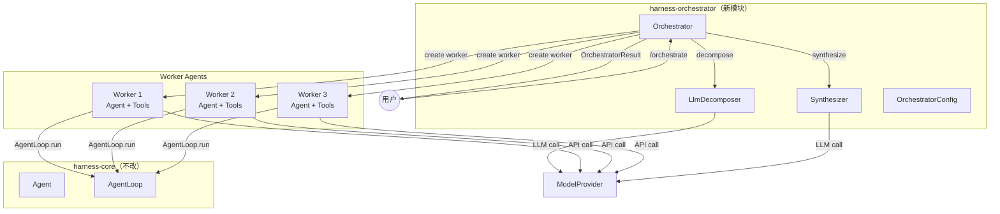
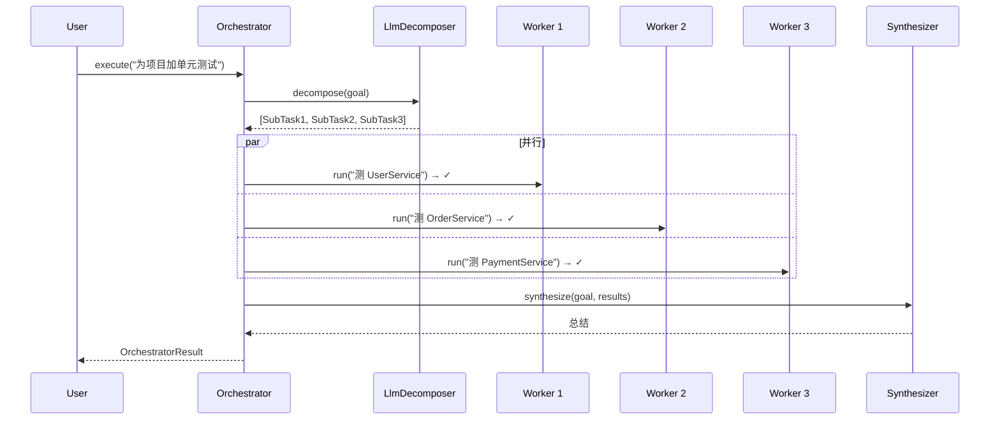

# Multi-Agent Orchestrator 设计规格

> 以任务分解（Orchestrator）为起点，架构上预留 Router/Collaborative 扩展点

**日期：** 2026-06-15  
**状态：** 设计已审查，待实现  
**依赖：** `harness-core`（Agent、AgentLoop、Sandbox），`harness-ai-core`（ModelProvider）

---

## 一、动机

当前 agent-harness 是单 Agent 架构：一个 `Agent` → 一个 `AgentLoop` → 一组工具。复杂任务（如"为整个项目添加单元测试"）在单 Agent 内串行执行，效率低，且单一 context 窗口难以容纳所有上下文。

本次设计引入 **Orchestrator**——将复杂目标分解为独立子任务，派发给多个 Worker Agent 并行执行，最后汇总结果。这是 multi-agent 能力的第一步，架构上预留了 Router（意图分发）和 Collaborative（多 Agent 对话）的扩展点。

---

## 二、架构

### 2.1 模块位置

新增 `harness-orchestrator` 模块，依赖 `harness-core` 公开 API。不改动现有三个模块任何一行代码。

```
agent-harness/
├── harness-ai-core/
├── harness-core/
├── harness-coding/
└── harness-orchestrator/          ← 新模块
    └── src/main/java/io/github/frank/harness/orchestrator/
        ├── common/
        │   ├── WorkerSpec.java
        │   ├── WorkerResult.java
        │   └── OrchestratorResult.java
        ├── orchestrator/
        │   ├── Orchestrator.java
        │   ├── OrchestratorConfig.java
        │   ├── decompose/
        │   │   ├── DecompositionStrategy.java
        │   │   ├── SubTask.java
        │   │   └── LlmDecomposer.java
        │   └── synthesize/
        │       ├── SynthesisStrategy.java
        │       ├── ConcatSynthesizer.java
        │       └── LlmSynthesizer.java
        ├── router/               ← Phase 2 预留
        │   └── package-info.java
        └── collaborative/        ← Phase 3 预留
            └── package-info.java
```

### 2.2 依赖方向

```
harness-coding → harness-core → harness-ai-core
                    ↑
           harness-orchestrator
```

Maven 坐标：`io.github.frank:harness-orchestrator`，版本跟随父 POM。

### 2.3 架构图



---

## 三、核心接口

### 3.1 Orchestrator（入口）

```java
public class Orchestrator {
    private final OrchestratorConfig config;
    private final DecompositionStrategy decomposer;
    private final SynthesisStrategy synthesizer;
    private final ModelProvider provider;

    /**
     * 执行流程：
     *   1. decompose(goal) → List<SubTask>
     *   2. 每个 SubTask → createWorker → AgentLoop.run → WorkerResult
     *   3. synthesize(goal, results) → final summary
     */
    public OrchestratorResult execute(String goal);
}
```

### 3.2 OrchestratorConfig

```java
public record OrchestratorConfig(
    int maxConcurrency,           // 默认 3
    Duration perWorkerTimeout,    // 默认 300s
    int maxWorkerTurns,           // 默认 10
    int maxRetries                // 默认 1
) {
    public static final OrchestratorConfig DEFAULT = new OrchestratorConfig(3,
        Duration.ofSeconds(300), 10, 1);
}
// TODO: PRODUCTION — 动态并发、分级超时
```

### 3.3 WorkerSpec & WorkerResult

```java
public record WorkerSpec(
    String role,                  // "coder" | "reviewer" | "researcher"
    String systemPrompt,
    List<Tool> tools,
    Sandbox sandbox,              // null = 共享 Orchestrator sandbox
    ModelConfig modelOverride     // null = 用 Orchestrator 模型
) {}

public record WorkerResult(
    String subtaskId,
    boolean success,
    String output,
    int turnsTaken,
    String errorMessage           // null if success
) {
    public static WorkerResult timeout(String id) { ... }
    public static WorkerResult error(String id, String msg) { ... }
}
```

### 3.4 DecompositionStrategy

```java
public interface DecompositionStrategy {
    List<SubTask> decompose(String goal);
}

public record SubTask(
    String id,
    String description,           // 完整、可执行的指令
    WorkerSpec spec,
    List<String> dependsOn        // 依赖的子任务 ID（Phase 4 启用）
) {}
```

**LlmDecomposer**：调 LLM，JSON 输出拆解结果。容错：JSON 解析失败 → 降级为单个 SubTask。

### 3.5 SynthesisStrategy

```java
public interface SynthesisStrategy {
    String synthesize(String goal, List<WorkerResult> results);
}
```

| 实现 | 逻辑 |
|------|------|
| `ConcatSynthesizer` | `## 子任务1\n{output}\n## 子任务2\n{output}` |
| `LlmSynthesizer` | 调 LLM 阅读所有结果，生成连贯总结 |

---

## 四、Worker Agent 生命周期

### 4.1 创建

每个 Worker 是完整 `Agent` 实例，独立 context/tools/AgentLoop。默认共享 Orchestrator 的 sandbox（子任务操作同一项目目录）。

### 4.2 执行

```java
List<WorkerResult> dispatch(List<SubTask> tasks) {
    var executor = Executors.newFixedThreadPool(config.maxConcurrency());
    List<CompletableFuture<WorkerResult>> futures = new ArrayList<>();

    for (var task : tasks) {
        futures.add(CompletableFuture.supplyAsync(() ->
            executeOneWorker(task), executor));
    }

    return futures.stream()
        .map(f -> {
            try { return f.get(config.perWorkerTimeout().toMillis(), MILLISECONDS); }
            catch (TimeoutException e) { return WorkerResult.timeout(task.id()); }
            catch (Exception e) { return WorkerResult.error(task.id(), e.getMessage()); }
        })
        .toList();
}
```

### 4.3 执行流程序列图



### 4.4 失败处理

| 场景 | 行为 |
|------|------|
| 子 Agent 超时 | `WorkerResult.timeout(id)`，不阻塞其他 Worker |
| 子 Agent 异常 | `WorkerResult.error(id, msg)`，Orchestrator 不崩溃 |
| 分解失败 | 降级：返回单个 SubTask（原 goal 直传） |
| 重试 | `config.maxRetries()` 次，重试原 SubTask |
| 全部 Worker 失败 | OrchestratorResult 标记 failed，逐个列出错误 |

---

## 五、并发安全

| 共享资源 | 风险 | 缓解 |
|---------|------|------|
| Sandbox（同一 workdir） | Worker 写同一文件 → 覆盖 | Prompt 引导文件不重叠 + WorkerSpec 注入文件清单 |
| ModelProvider | 多 Worker 共用 API Key | OkHttp 线程安全。后期加令牌桶。 |
| Agent.context | 每个 Worker 独立 Agent | ✅ 无风险 |
| AgentLoop | 每个 Worker 独立实例 | ✅ 无风险 |
| JsonlSessionStore | 不同 taskId 不同文件 | ✅ 无风险 |
| System.out | 多 Worker 同时打印 | 子 Agent 静默。后期加结构化日志。 |

---

## 六、CLI 集成

```java
// HarnessCLI 新增命令
> /orchestrate 为整个项目添加单元测试

🎯 Orchestrating: 为整个项目添加单元测试
   拆分为 3 个子任务...
   [coder-1] 为 UserService 写单元测试... ✓
   [coder-2] 为 OrderService 写单元测试... ✓
   [coder-3] 为 PaymentService 写单元测试... ✓
   汇总中...

📋 完成：3/3 子任务成功
   共生成 42 个测试用例，覆盖 3 个 Service 类
```

普通对话仍走原单 Agent 路径（`> prompt`）。

---

## 七、配置文件

```yaml
# .harness/config.yaml 新增
orchestrator:
  enabled: true
  maxConcurrency: 3
  perWorkerTimeout: 300s
  maxWorkerTurns: 10
  maxRetries: 1
  decomposition:
    strategy: llm
    maxSubtasks: 5
  synthesis:
    strategy: llm

  # Phase 2 预留
  # router:
  #   agents:
  #     coder: { tools: [...], model: gpt-4o }
  #     reviewer: { tools: [...], model: gpt-4o-mini }

  # Phase 3 预留
  # collaborative:
  #   maxTurns: 20
```

---

## 八、测试策略

### 8.1 测试分层

```
LlmDecomposerTest     — Mock ModelProvider，验证解析逻辑
ConcatSynthesizerTest  — 纯逻辑，无依赖
OrchestratorConfigTest — 默认值
OrchestratorTest      — ★ Mock 子 Agent 执行，验证全流程
```

### 8.2 关键用例

```
LlmDecomposerTest:
  ✓ 正常 JSON → 3 个 SubTask
  ✓ 单任务 → 1 个 SubTask
  ✓ JSON 错误 → 降级单个 SubTask
  ✓ LLM 超时 → 降级单个 SubTask

ConcatSynthesizerTest:
  ✓ 3 success → 拼接
  ✓ 1 fail + 2 success → 包含失败信息

OrchestratorTest:
  ✓ 正常：3 Worker 并行 → 汇总成功
  ✓ 部分失败：1 timeout + 2 success
  ✓ 全失败：3 error
  ✓ maxConcurrency=1 → 串行验证
  ✓ 降级：分解失败 → 单 Worker
```

---

## 九、演进路线图

| Phase | 内容 | 模块位置 |
|-------|------|---------|
| **1**（本次） | Orchestrator 核心 — 分解/调度/汇总 + CLI | `orchestrator/` |
| **2** | Router — 意图识别 + 按角色分发 | `router/`（包已建） |
| **3** | Collaborative — 多 Agent 对话 + 共享黑板 | `collaborative/`（包已建） |
| **4** | 生产级 — DAG 调度、动态并发、资源配额、全链路追踪 | 各包扩散 |

---

*设计日期：2026-06-15 | 架构原则：harness-core 零改动，通过公开 API 构建*
