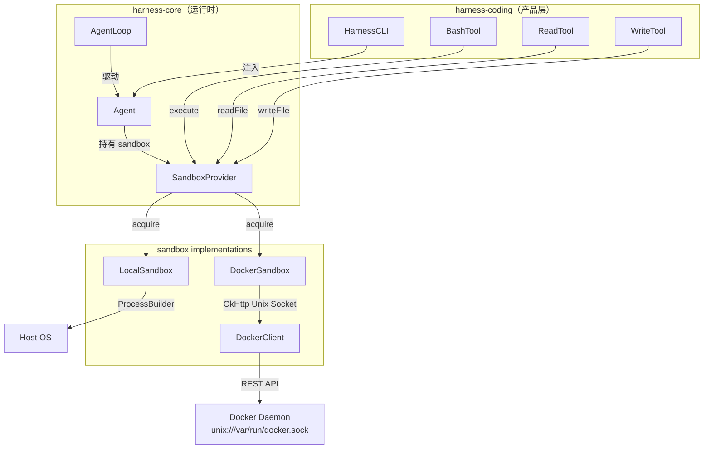

# Agent Harness Sandbox 设计规格

> Docker 容器级隔离执行环境 — 从裸 ProcessBuilder 到生产级沙箱的第一版落地设计

**日期：** 2026-06-15  
**状态：** 设计已审查，待实现  
**参考：** DeerFlow sandbox 分析（2026-05-12 会话）、AI Agent Harness Engineering 5 层架构

---

## 一、动机

当前 `BashTool` 直接调用 `ProcessBuilder("bash", "-c", command)`，命令在宿主机上裸跑，无任何隔离：

- Agent 可以 `rm -rf /` 删除宿主机文件
- Agent 可以读取 `.env`、SSH key 等敏感文件
- Agent 产生的临时文件直接落在宿主机磁盘上

本次设计引入 **Sandbox 抽象层**，将命令/文件操作统一封装，支持两种后端：
1. **LocalSandbox**：向后兼容，保持现有行为，但加了执行锁
2. **DockerSandbox**：容器级隔离，文件系统、进程、（未来）网络全隔离

---

## 二、架构

### 2.1 模块位置

sandbox 代码放在 `harness-core` 模块下，作为核心执行抽象：

```
agent-harness/
├── harness-core/
│   └── src/main/java/io/github/frank/harness/core/
│       └── sandbox/
│           ├── Sandbox.java               # 接口 (6 methods + Closeable)
│           ├── SandboxConfig.java         # 配置 record
│           ├── SandboxProvider.java       # 工厂 (acquire/release)
│           ├── LocalSandbox.java          # ProcessBuilder 实现
│           ├── LocalSandboxProvider.java  # 单例 provider
│           ├── DockerClient.java          # OkHttp → Docker Unix Socket REST
│           ├── DockerSandbox.java         # 容器生命周期 + exec
│           └── DockerSandboxProvider.java # 每 session 创建/销毁容器
│
├── harness-coding/
│   └── src/main/java/io/github/frank/harness/coding/
│       ├── tool/BashTool.java             # 改：调用 sandbox.execute()
│       ├── tool/ReadTool.java             # 改：调用 sandbox.readFile()
│       ├── tool/WriteTool.java            # 改：调用 sandbox.writeFile()
│       └── cli/HarnessCLI.java            # 改：注入 SandboxProvider
```

### 2.2 依赖方向

```
harness-coding → harness-core → harness-ai-core
                     ↑
              sandbox 包在此

零新 Maven 依赖。harness-core pom 补一行 OkHttp（版本 4.12.0 已在本地缓存）。
```

### 2.3 架构图



---

## 三、接口设计

### 3.1 Sandbox

```java
public interface Sandbox extends AutoCloseable {
    ToolResult execute(String command, Duration timeout);
    String readFile(String path);
    void writeFile(String path, String content);
    List<String> listDir(String path);
    List<String> glob(String pattern);
    @Override void close();
}
```

**路径语义：** 所有路径都是沙箱内部路径（如 `/workspace/main.py`）。实现层负责路径翻译——`LocalSandbox` 映射到宿主路径，`DockerSandbox` 在容器内直接使用。

### 3.2 SandboxConfig

```java
public record SandboxConfig(
    SandboxMode mode,
    Path hostWorkdir,          // 宿主机工作目录
    String dockerImage,        // 默认 "ubuntu:22.04"
    Duration defaultTimeout,   // 默认 120s
    long maxOutputBytes        // 默认 1MB
) {
    public enum SandboxMode { LOCAL, DOCKER }
}
```

### 3.3 SandboxProvider

```java
public interface SandboxProvider {
    Sandbox acquire(SandboxConfig config);
    void release(Sandbox sandbox);
}
```

### 3.4 Agent 改动

```java
public class Agent {
    private final Sandbox sandbox;  // ← 新增

    public Agent(List<Tool> tools, ModelConfig config,
                  List<ToolHook> hooks, Sandbox sandbox) { ... }

    public Sandbox getSandbox() { return sandbox; }
}
```

---

## 四、实现方案

### 4.1 LocalSandbox

```java
public final class LocalSandbox implements Sandbox {
    private final Path workdir;
    private final Duration timeout;
    private final long maxOutputBytes;
    private final Object execLock = new Object();  // 串行执行锁

    @Override
    public ToolResult execute(String command, Duration timeout) {
        synchronized (execLock) {
            // ProcessBuilder("sh", "-c", command)
            // redirectErrorStream(true)
            // waitFor(timeout) + 输出截断
        }
    }
}
```

### 4.2 DockerClient — OkHttp 直接打 Docker Unix Socket

```java
/**
 * Talks to Docker daemon via Unix socket at /var/run/docker.sock.
 * Zero new dependencies — OkHttp 4.12.0 already in project.
 *
 * Only implements the 4 endpoints we need:
 *   POST /containers/create
 *   POST /containers/{id}/start
 *   POST /containers/{id}/exec
 *   POST /exec/{id}/start
 *   DELETE /containers/{id}
 */
class DockerClient implements AutoCloseable {
    private final OkHttpClient http;

    DockerClient(String socketPath) {
        this.http = new OkHttpClient.Builder()
            .socketFactory(new UnixSocketFactory(socketPath))
            .build();
    }
}
```

### 4.3 DockerSandbox

```java
public final class DockerSandbox implements Sandbox {
    private final DockerClient client;
    private final String containerId;
    private final String containerWorkdir;
    private final Path hostWorkdir;
    private final Duration timeout;
    private final long maxOutputBytes;
    private final Object execLock = new Object();

    /**
     * Create container:
     *   POST /containers/create
     *   Body: Image, Cmd=["tail","-f","/dev/null"],
     *         HostConfig.Binds=["{hostWorkdir}:/workspace"],
     *         WorkingDir="/workspace"
     *   Then POST /containers/{id}/start
     */
    DockerSandbox(DockerClient client, SandboxConfig config) { ... }

    @Override
    public ToolResult execute(String command, Duration timeout) {
        synchronized (execLock) {
            // POST /containers/{id}/exec (create exec instance)
            // POST /exec/{id}/start (run, return stdout)
        }
    }

    @Override
    public void close() {
        // DELETE /containers/{id}?force=true
    }
}
```

**关键设计决策——串行执行锁：** Docker exec 共享同一个容器的 stdin/stdout，并发 exec 会互相干扰（DeerFlow 的 AioSandbox 也用 `threading.Lock` 处理同样的问题）。

### 4.4 工具改造

```java
// Before
BashTool.create(workdir, timeout)

// After
BashTool.create(sandbox, timeout)
// 内部调用 sandbox.execute(command, timeout)
```

`ReadTool` → `sandbox.readFile(path)`，`WriteTool` → `sandbox.writeFile(path, content)`。

---

## 五、生命周期

```yaml
启动:
  HarnessCLI 读取 config.yaml → 选择 SandboxMode
  → SandboxProvider.acquire(config) → Sandbox

运行:
  每个 turn 的工具调用 → Agent.getSandbox().execute/readFile/writeFile

关闭:
  ShutdownHook → provider.release(sandbox) → sandbox.close()
  LocalSandbox.close(): no-op
  DockerSandbox.close(): 销毁容器
```

---

## 六、配置文件

```yaml
# .harness/config.yaml 新增 sandbox 段
sandbox:
  mode: local                       # local | docker
  dockerImage: ubuntu:22.04
```

生产演进预留段（配置格式已设计，代码暂不实现，用 TODO 标注）：

```yaml
# TODO: PRODUCTION
sandbox:
  mode: docker
  dockerImage: agent-sandbox:latest  # 预装 python/node/git
  resourceLimits:
    memory: "512m"
    cpus: "1.0"
    maxPids: 100
    network: none
    readOnlyRootfs: true
  pool:
    warmSize: 3
    maxSize: 20
    idleTimeout: 300s
```

---

## 七、测试策略

### 7.1 测试分层

| 层级 | 内容 | 依赖 |
|------|------|------|
| `LocalSandboxTest` | execute/read/write/锁/超时 | 真实文件系统 |
| `DockerSandboxTest` | 用 Mock HTTP 响应测试容器创建/exec/销毁 | Mock DockerClient |
| `SandboxProviderTest` | acquire/release 逻辑 | LocalSandboxProvider + Mock Docker |

### 7.2 关键用例

```
LocalSandbox:
  ✓ execute("echo hello") → "hello\n"
  ✓ execute("sleep 5") + 1s timeout → error "Timed out"
  ✓ writeFile("/data.txt", "x") → readFile("/data.txt") → "x"
  ✓ 并发 execute 排队（第二个等锁释放后执行）

DockerSandbox（Mock）:
  ✓ /containers/create 200 → containerId 赋值
  ✓ /exec/{id}/start 200 + stdout → ToolResult.success(stdout)
  ✓ close() → DELETE /containers/{id} 被调用
  ✓ /containers/create 404 → RuntimeException
```

```text
TODO: PRODUCTION — 真实 Docker 集成测试（TestContainers 或本地 daemon）
TODO: PRODUCTION — Docker daemon 不可达（ConnectException）
TODO: PRODUCTION — 容器中途崩溃（exec 500 → unhealthy 标记）
TODO: PRODUCTION — 输出超限（> maxOutputBytes → 截断 + warning）
```

---

## 八、实现阶段

| Phase | 内容 | 涉及文件 |
|-------|------|---------|
| **P1** | `harness-core` 新增 sandbox 包 + 接口 | Sandbox.java, SandboxConfig.java, SandboxProvider.java |
| **P2** | LocalSandbox 实现 + 锁 | LocalSandbox.java, LocalSandboxProvider.java |
| **P3** | DockerClient + DockerSandbox | DockerClient.java, DockerSandbox.java, DockerSandboxProvider.java |
| **P4** | 工具改造 | BashTool.java, ReadTool.java, WriteTool.java |
| **P5** | Agent + CLI 注入 | Agent.java, HarnessCLI.java |
| **P6** | pom 调整 | harness-core/pom.xml（加 OkHttp） |
| **P7** | 测试 | LocalSandboxTest, DockerSandboxTest |
| **P8** | 编译验证 | `mvn compile` |

每阶段完成后独立 `mvn compile` 验证，不积压问题。

---

## 九、生产演进路线图

| 标记 | 内容 | 触发条件 |
|------|------|---------|
| `TODO: PRODUCTION` | 容器资源限制（memory/cpu/pids/network） | 多用户部署前 |
| `TODO: PRODUCTION` | 根文件系统只读 + 白名单可写路径 | 安全审计前 |
| `TODO: PRODUCTION` | PooledDockerSandboxProvider（容器池） | 并发 session > 50 |
| `TODO: PRODUCTION` | 优雅关闭（SIGTERM → wait → SIGKILL） | 容器泄漏 bug 出现 |
| `TODO: PRODUCTION` | 危险命令审批（已移至独立 HITL spec：docs/specs/2026-06-15-hitl-design.md） | 开放外部用户 |
| `TODO: PRODUCTION` | docker-java SDK 替代手写 HTTP | 需要完整 Docker API |
| `TODO: PRODUCTION` | sandbox 健康检查 + 自动重建 | 容器异常中断 |
| `TODO: PRODUCTION` | Docker 真实环境集成测试 | CI 环境有 Docker |
| `TODO: PRODUCTION` | 预构建镜像（python/node/git 预装） | 首次使用 docker mode |
